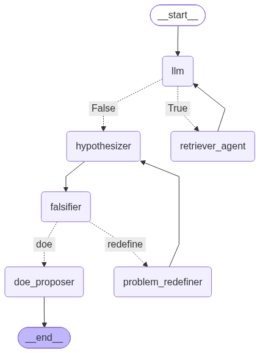

# HypoGen: Autonomous Scientific Hypothesis Generator

**HypoGen** is an advanced AI agent designed to automate the early stages of scientific research. By leveraging **Retrieval-Augmented Generation (RAG)** and a **multi-stage reasoning graph**, HypoGen transforms raw scientific literature (PDFs/Text) into rigorously audited, testable hypotheses and detailed Designs of Experiment (DoE).

Unlike standard RAG pipelines, HypoGen implements a **Self-Correction Loop**, where a dedicated "Falsifier" agent audits proposed hypotheses against factual evidence, forcing the system to redefine the problem if contradictions are found.

---

## Key Features

- ** Automated Literature Synthesis:** Ingests folders of PDFs and TXT files, creating a local vector database via ChromaDB.
- ** Agentic Reasoning Loop:** Uses `LangGraph` to manage a stateful workflow:
    - **Literature Analyst:** Iteratively queries the database to gather evidence.
    - **Hypothesizer:** Synthesizes a causal, testable hypothesis.
    - **Falsifier (The Auditor):** Actively searches for contradictions between the hypothesis and the retrieved facts.
    - **Problem Redefiner:** Pivots the research question if the hypothesis is falsified.
- ** Experimental Design (DoE):** Automatically generates a Full Factorial Design based on the identified variables to verify the final hypothesis.
- ** Hallucination Mitigation:** Temperature is set to `0` and prompts are strictly grounded in retrieved evidence.

---

## System Architecture

The agent operates as a state machine using a directed graph:

```mermaid
graph TD
    A [Start: Scientific Problem] --> B[LLM Literature Analyst]
    B --> C{Needs More Info?}
    C -- Yes --> D[Retriever Tool]
    D --> B
    C -- No --> E[Hypothesizer]
    E --> F[Falsifier/Auditor]
    F --> G{Contradiction Found?}
    G -- Yes --> H[Problem Redefiner]
    H --> E
    G -- No --> I[DoE Proposer]
    I --> J[Final Output: Facts + Hypothesis + DoE]
```



---

## Prerequisites

- **Python 3.10+**
- **Ollama:** (To run LLMs and Embedding models locally)
  - [Download Ollama](https://ollama.ai/)
- **Models:** Ensure you have pulled the models defined in your `.env` (e.g., 
`qwen3:8b`, `qwen3-embedding:8b`).

---

## Installation & Setup

### 1. Clone the Repository
```bash
git clone https://github.com/markus-schindler/HypoGen.git
cd HypoGen
```

### 2. Install Dependencies
```bash
pip install -r requirements.txt
```
*(Note: Ensure you have `langchain`, `langgraph`, `chromadb`, `pypdf`, `ollama`, and 
`python-dotenv` installed.)*

### 3. Configure Environment
Create a `.env` file in the root directory:
```env
LLM="qwen3:8b"
LLM_EMBEDDING="qwen3-embedding:8b"
RETRIEVER_K=5
RETRIEVER_FETCH_K=20
COLLECTION_NAME="Zeolite"
```

---

## Usage

1. **Prepare your data:** Place your scientific PDFs or text files in a folder (e.g., 
`./documents`).
2. **Run the agent:**
```bash
python HypoGen.py --document_path ./documents --database_path ./ChromaDB
```

### Example Workflow:
- **Input:** *"The effect of high salt concentrations in the synthesis of zeolite A making smaller crystals."*
- **Agent Process:**
    1. Searches literature for salt as additive in zeolite synthesis.
    2. Proposes: *"The interactions of cations impacts the nucleation process reducing crystal growth rate«."*
    3. **Falsifier** finds a paper stating that certain additives produces larger zeolite crystals. 
    4. **Redefiner** pivots the problem to: *"The effect of high aluminum concentrations and low synthesis temperature."*
    5. **DoE Proposer** creates a $2^2$ factorial design testing Temperature vs. Additive Concentration.

---

## Project Structure

- `HypoGen.py`: Main agent logic, graph definition, and RAG implementation.
- `.env`: Configuration for models and retriever parameters.
- `requirements.txt` : Python dependancies
- `documents/`: Folder containing source scientific papers.
- `ChromaDB/`: Local persistence directory for the vector store.
- `Graph.png`: Graph structure  
- `README.md`: This file
- `output.txt`: Log of all generated hypotheses and DoEs.
- `LICENSE` MIT License
---

## License

This project is licensed under the **MIT License**.

**Author:** Markus Schindler  
**Version:** 0.1.0  
**Status:** Education / Research Prototype

© 2026 Markus Schindler
