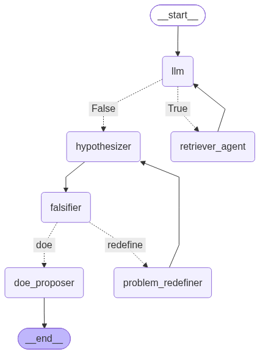

# HypoGen: Autonomous Scientific Hypothesis Generation Agent

**HypoGen** is an advanced AI agent designed to automate the early stages of scientific research. Unlike standard RAG (Retrieval-Augmented Generation) pipelines, HypoGen implements a **cognitive loop**: it doesn't just find information—it generates a hypothesis, attempts to falsify it against the evidence, refines the problem statement if contradictions are found, and finally proposes a rigorous **Design of Experiment (DoE)** for empirical verification.

[](https://choosealicense.com/licenses/mit-license/)
[](https://www.python.org/)
[](https://ollama.com/)

## Core Features

- **Agentic RAG Workflow**: Utilizes `LangGraph` to create a stateful, cyclic graph of specialized agents.
- **Automated Falsification**: A dedicated "Scientific Auditor" agent checks hypotheses for contradictions against retrieved facts.
- **Self-Correcting Loop**: If a contradiction is detected, the "Problem Redefiner" agent pivots the research angle and restarts the cycle (up to 3 iterations).
- **DoE Generation**: Translates theoretical hypotheses into a concrete experimental framework (Full Factorial Design: $2^2, 2^3, 2^4$).
- **Local-First Privacy**: Integrated with `Ollama` for local LLM execution and `ChromaDB` for vector storage.

## Tech Stack

- **Orchestration**: [LangGraph](https://github.com/langchain-ai/langgraph) & [LangChain](https://github.com/langchain-ai/langchain)
- **LLM & Embeddings**: [Ollama](https://ollama.com/) (Local execution)
- **Vector Store**: [ChromaDB](https://www.trychroma.com/)
- **Document Parsing**: `pypdf`
- **State Management**: Python `TypedDict` & `Annotated` sequences

## Agent Architecture

The agent operates as a State Machine with the following nodes:

1.  **LLM / Retriever Agent**: Queries the vector database to gather factual evidence.
2.  **Hypothesizer**: Synthesizes evidence into a single, causal, testable hypothesis.
3.  **Falsifier**: Acts as a peer reviewer to find logical contradictions.
4.  **Problem Redefiner**: (Conditional) Adjusts the research question if the falsifier finds flaws.
5.  **DoE Proposer**: Final stage; creates a detailed experimental protocol.

**The Loop:**  
`Start` $\rightarrow$ `Retriever` $\rightarrow$ `Hypothesizer` $\rightarrow$ `Falsifier` $\rightarrow$ *(if contradiction) $\rightarrow$ `Problem Redefiner` $\rightarrow$ `Hypothesizer` ... $\rightarrow$ `DoE Proposer` $\rightarrow$ `End`



**Figure 1:** Graph structure for HypoGen Agent.

## Installation & Setup

### 1. Prerequisites
- Install [Ollama](https://ollama.com/) and pull your desired models:
  ```bash
  ollama pull llama3 # or your preferred LLM
  ollama pull nomic-embed-text # or your preferred embedding model
  ```

### 2. Clone and Install
```bash
git clone https://github.com/markus-schindler/hypogen.git
cd hypogen
pip install -r requirements.txt
```

### 3. Configuration
Create a `.env` file in the root directory:
```env
LLM=llama3
LLM_EMBEDDING=nomic-embed-text
RETRIEVER_K=5
RETRIEVER_FETCH_K=20
COLLECTION_NAME=scientific_papers
```

## Usage

1. Place your scientific PDFs or text files in the `/documents` folder.
2. Run the agent:
   ```bash
   python HypoGen.py --document_path ./documents --database_path ./ChromaDB
   ```
3. Enter your scientific problem statement when prompted.
4. The agent will output:
   - **Gathered Facts**
   - **Proposed Hypothesis**
   - **Falsification Analysis**
   - **Design of Experiment (DoE)**

## Project Structure
```text
├── ChromaDB/           # Local persistence directory for vector store
├── documents/          # Scientific Papers (PDF, TXT format)
├── .env                # Configuration for model and retriever
├── HypoGen.py          # Main agent logic, graph definition, and RAG implementation
├── README.md           # This file
├── requirements.txt    # Dependency list
└── LICENSE             # MIT License
```

## License

This project is licensed under the Unlicense - see the LICENSE file for details

© 2026 Markus Schindler
